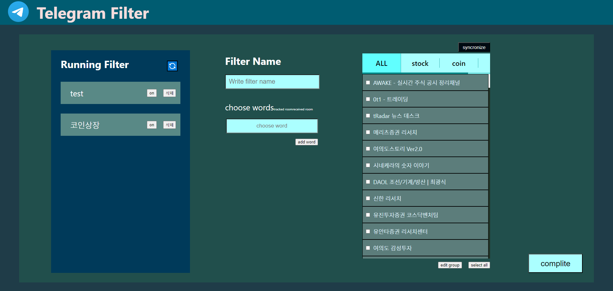
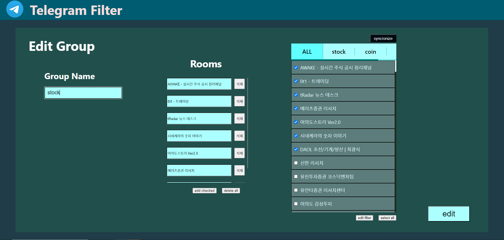

# Telegram Filter 프로그램

## 프로그램 실행 방법

### Front 실행 방법

1. npm install을 통해 필요 라이브러리 설치

2. npm start를 통해 프론트 실행

### Back 실행 방법

1. https://my.telegram.org/auth에 접속 후 API 해시키 발급

2. .env 파일에 위에서 받은 값을 토대로 아래 정보 입력. 
   <code>
   telegram_id = "APP API_ID"
   telegram_hash = "APP API_HASH"
   telegram_phone = "로그인시 사용한 번호"
   </code>

3. requirements.txt 파일 설치

4. login.py 실행을 통해 back서버에서 사용할 session 파일 생성

5. python run.py 실행

## 프로그램 UI

#### [Figma 디자인 링크](https://www.figma.com/design/WzQmaG8t5XVPgx28OrpG1S/Telegram-Filter?node-id=0-1&node-type=canvas&t=c84TRMWl8cFwjQuN-0)

## 프로그램 사용 방법

1. 프로그램 실행 이후 synchronize 버튼을 통해 연결한 텔레그램 계정의 그룹 목록을 불러온다.

2. Filter Name에 Filter 이름을 입력한다.

3. choose words를 통해 필터링에 사용할 단어를 입력 후 add word 버튼을 통해 추가한다.

4. tracked room을 클릭 후 우측에서 트랙킹 하고 싶은 room을 모두 클릭 후 add checked 버튼을 클릭한다.

5. received room을 클릭 후 트랙킹을 통해 받은 정보를 어떤 방에 보낼지 정한다.

6. complete 버튼을 클릭해 Running Filter에 추가한다.

7. 우측 on off 버튼을 on으로 설정 후 🔄 버튼을 클릭한다.
